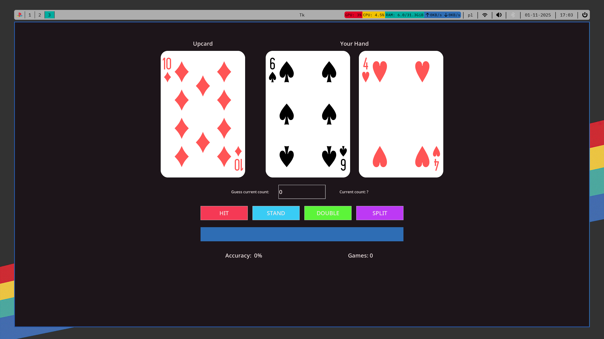

# **Blackjack Trainer**

## **Purpose and rules**

This is a simple blackjack training software for memorizing basic strategy written in tkinter. It shows an upcard and a hand, and after you make a move, it compares it to what the correct one was based on basic strategy and gives you feedback on whether you made a mistake or not.  
  
  As it is **NOT** a game or a simulator, no more cards will be drawn after each move, and you will just be given the next hand and shown a new upcard.  
  
  Also every 5 hands (and on the first hand), you will have to enter the current count before you will be allowed to make a move.  
  
  The count is calculated using Hi-Opt II strategy (+1 for 2, 3, 6, 7; +2 for 4, 5; -2 for all tens; the rest is 0).

## **Usage**

Just install dependencies from ***dependencies.txt*** with *pip install dependencies.txt* and run ***python play.py*** or (linux only) download ***compiled.zip*** which contains compiled binary and run it. The zip file also contains all the assets the trainer uses.

## **License**

MIT License

Copyright (c) 2025 KufloweMocneFan

Permission is hereby granted, free of charge, to any person obtaining a copy
of this software and associated documentation files (the "Software"), to deal
in the Software without restriction, including without limitation the rights
to use, copy, modify, merge, publish, distribute, sublicense, and/or sell
copies of the Software, and to permit persons to whom the Software is
furnished to do so, subject to the following conditions:

The above copyright notice and this permission notice shall be included in all
copies or substantial portions of the Software.

THE SOFTWARE IS PROVIDED "AS IS", WITHOUT WARRANTY OF ANY KIND, EXPRESS OR
IMPLIED, INCLUDING BUT NOT LIMITED TO THE WARRANTIES OF MERCHANTABILITY,
FITNESS FOR A PARTICULAR PURPOSE AND NONINFRINGEMENT. IN NO EVENT SHALL THE
AUTHORS OR COPYRIGHT HOLDERS BE LIABLE FOR ANY CLAIM, DAMAGES OR OTHER
LIABILITY, WHETHER IN AN ACTION OF CONTRACT, TORT OR OTHERWISE, ARISING FROM,
OUT OF OR IN CONNECTION WITH THE SOFTWARE OR THE USE OR OTHER DEALINGS IN THE
SOFTWARE.

All the assets are taken from wikipedia and are under the [CC0](https://creativecommons.org/publicdomain/zero/1.0/deed.en) license.

